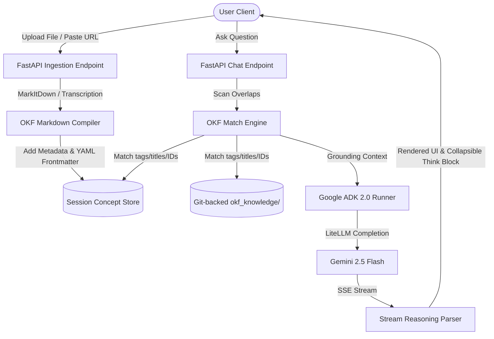

# ADK & OKF Grounded Chat Studio 🌐🤖

A standalone, deterministic grounding playground for AI agents built on the **Google Agent Development Kit (ADK) 2.0** and the Git-backed **Open Knowledge Format (OKF)** specification. 

This repository implements a full-stack, local-first developer sandbox featuring a streaming React/Vite chat interface, a Python FastAPI agent runner, and an automated client-side document/URL ingestion compiler.

---

<p align="center">
  
  
  
  
  
  
</p>

---

## ⚡ Core Value: Grounding Over Opaque RAG

Traditional Retrieval-Augmented Generation (RAG) models index documents as flat, unstructured datasets, querying them dynamically using vector databases. While vector search is powerful, it introduces latency, opacity, context-drift, and expensive API consumption.

**ADK & OKF Grounded Chat Studio** implements a cleaner paradigm:
*   **Local Ground-Truth Dominance**: The agent prioritizes local, curated Markdown concepts defined under the Open Knowledge Format (OKF) before falling back to general LLM reasoning.
*   **Git-Backed Knowledge Versioning**: Plain text Markdown files stored inside the repository represent the agent's knowledge base. Updates are managed via standard developer workflows (commits, pull requests, and peer code/doc reviews).
*   **Client-Side Ingestion Sandbox**: Drag-and-drop complex document types (PDFs, images, audios, Pages, Numbers, Keynote) or paste URLs. The backend compiles them into OKF-compliant Markdown files on the fly.
*   **Offline Sentence Synthesis**: A toggled "Pure OKF Mode" completely bypasses LLMs, executing a local, rule-based search, extractive sentence synthesis, and potential follow-up suggestions 100% privately.


---

## 🆚 Comparative Analysis

| Feature | Karpathy's "LLM Wiki" Pattern | Static OKF Catalogs | ADK-OKF Grounded Chat Studio (This Project) |
| :--- | :--- | :--- | :--- |
| **Form Factor** | Conceptual design pattern & folder structure | Static Git documentation repository | Full-stack web application & developer sandbox |
| **Ingestion** | Manual editing / copy-pasting | Hand-crafted Markdown files | Drag-and-drop parser for PDFs, audio, images, and live URLs |
| **Execution** | Manual reading in Obsidian/VS Code | Parser script (e.g., basic Python matching) | Google ADK 2.0 workflow graph runner with SSE streaming |
| **Reasoning Isolation** | N/A | Inline text dump | Dynamic stream parser that isolates `<think>` blocks and displays them in a collapsible accordion |
| **Privacy Safeguards** | Purely manual / Local files | Local storage only | "Pure OKF Mode" for LLM-free sentence synthesis and "Toggle AI Fallback" switches |

### How it differs from Karpathy's LLM Wiki example
Andrej Karpathy's **LLM Wiki** is a design pattern for compiling knowledge into interlinked, entity-based markdown files (`[[wiki-links]]`) where the AI acts as a librarian. 
This project is the **operational execution playground** for that pattern. Instead of editing files by hand, users can drop raw research (such as a sales PDF, an audio memo, or a web link) into the browser. The system parses it, generates metadata tags, stores it in memory, and immediately grounds the ADK Agent. Furthermore, this project is a fully styled React app running a dynamic chat interface with custom persona configuration (name, tone, behavior instructions) and reasoning isolation.

---

## 🏗️ Architecture

The backend implements a dual-layer grounding engine:
1.  **System Concepts**: Pre-defined OKF concepts committed directly to git under `okf_knowledge/`.
2.  **Client-Side Concepts**: Temporary concepts uploaded, parsed, and compiled dynamically during the user's browser session.



---

## 🛠️ Code Highlights

### Google ADK 2.0 Runner Initialization
The FastAPI backend initializes the Google ADK runner with in-memory persistence:
```python
from google.adk import Agent, Runner
from google.adk.apps import App
from google.adk.sessions.in_memory_session_service import InMemorySessionService
from google.adk.artifacts.in_memory_artifact_service import InMemoryArtifactService
from google.adk.memory.in_memory_memory_service import InMemoryMemoryService

agent = Agent(
    name="okf_agent",
    model="openrouter/google/gemini-2.5-flash",
    instruction="You are a grounding assistant."
)

adk_app = App(name="okf_agent_app", root_agent=agent)
runner = Runner(
    app=adk_app,
    artifact_service=InMemoryArtifactService(),
    session_service=InMemorySessionService(),
    memory_service=InMemoryMemoryService(),
)
```

### In-Memory Dynamic Grounding
Grounding context is dynamically formatted and injected directly into the ADK agent instructions:
```python
agent.instruction = f"""{base_instruction}

[REASONING RULES]:
1. Prioritize Grounding: You must prioritize the facts, figures, and relationships defined in the provided [GROUNDING CONTEXT] above all else.
2. Cross-Document Synthesis: Identify correlations and summarize key insights.

[GROUNDING CONTEXT]:
{grounding_context}
"""
```

---

## ⚙️ Installation & Running

### Prerequisites
*   Node.js (v18+)
*   Python 3.10+
*   Pip

### 1. Setup Frontend
```bash
cd frontend
npm install
```

### 2. Setup Backend & Virtual Environment
```bash
cd backend
python3 -m venv .venv
source .venv/bin/activate
pip install -r requirements.txt
```

### 3. Start the Application
We provide a unified startup script at the root that compiles React assets, starts the FastAPI server, and launches the Vite React HMR developer server concurrently:
```bash
chmod +x start.sh
./start.sh
```
*   **React Developer UI**: [http://localhost:5173/](http://localhost:5173/)
*   **FastAPI Backend Server**: [http://localhost:8040/](http://localhost:8040/)

---

## 📁 Repository Structure

```
├── backend/
│   ├── app.py                # FastAPI main application & SSE chat endpoint
│   ├── okf_engine.py         # Deterministic concept loader and overlap matcher
│   ├── shared.py             # OpenRouter and LiteLLM configurations
│   └── requirements.txt      # Python dependencies (adk, litellm, markitdown)
├── frontend/
│   ├── src/
│   │   ├── components/
│   │   │   ├── Chat.tsx      # Main grounded chat UI component
│   │   │   └── Markdown.tsx  # Optimized markdown renderer
│   │   ├── App.tsx
│   │   └── main.tsx
│   └── package.json
├── okf_knowledge/            # Git-backed knowledge repository
│   ├── concept_adk.md        # Concept page: Agent Development Kit metadata
│   ├── concept_okf.md        # Concept page: Open Knowledge Format specs
│   └── datasets/
│       └── sales.md          # Nested concept page: GA4 e-commerce schema
└── start.sh                  # Unified app launcher
```

---

## 🎖️ Credits & Version Matrix

This project integrates and showcases several state-of-the-art developer tools:

| Component / Library | Version | Creator / Spec Author | Description / Purpose |
| :--- | :--- | :--- | :--- |
| **Open Knowledge Format** | Spec v1.0 (2026) | Google Cloud | Vendor-neutral spec for portable Git-based markdown catalogs. |
| **Google ADK** | `google-adk>=2.0.x` | Google DeepMind | Code-first multi-agent orchestration framework. |
| **MarkItDown** | `markitdown>=0.0.1` | Microsoft | Local document parser converting docs, PDFs, audio, and images to markdown. |
| **FastAPI** | `fastapi>=0.111.0` | Sebastian Ramírez | Modern, high-performance web API framework serving backend endpoints. |
| **React** | `react^19.0.0` | Meta | Client UI library powering chat and settings. |
| **Vite** | `vite^6.0.0` | Evan You | High-speed build tooling and dev server with HMR. |
| **LiteLLM** | `litellm>=1.40.0` | BerriAI | Universal model router interfacing with OpenRouter and Google GenAI. |

*This playground was co-authored and designed in collaboration with the **Antigravity AI Coding Assistant** from Google DeepMind.*

---

## 📄 License
This project is open-source and available under the **MIT License**.
